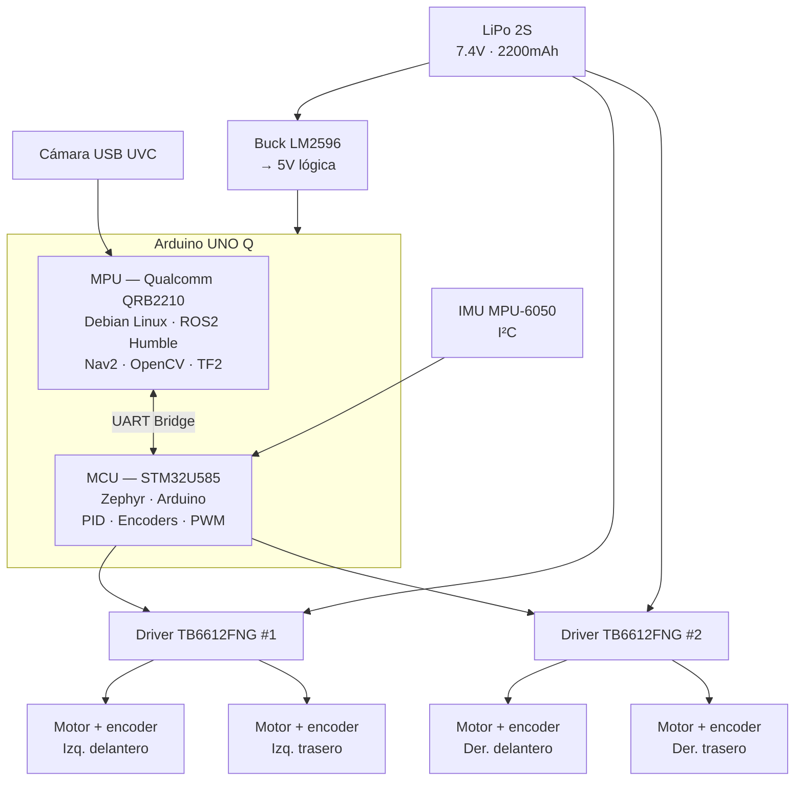

# minibot-ros2

> Robot autónomo de 4 ruedas construido sobre ROS2 Humble y Arduino UNO Q.
> Proyecto personal para aprender cinemática diferencial, odometría, PID y navegación autónoma con Nav2.


---

## ¿Qué es este proyecto?

minirobot-ros2 es un robot construido desde cero como proyecto de aprendizaje. 
El objetivo no es solo que el robot funcione sino que entender cada subsistema
desde los fundamentos matemáticos hasta la implementación en ROS2.

El robot es capaz de:
- [ ] Moverse con control diferencial desde teleop
- [ ] Calcular odometría con encoders de cuadratura
- [ ] Mantener velocidad con PID implementado en STM32
- [ ] Esquivar obstáculos con cámara y OpenCV
- [ ] Navegar autónomamente con Nav2

---

## Arquitectura 


→ Documentación técnica completa en [`docs/architecture.md`](docs/architecture.md)

---

## Fases del proyecto

| Fase | Contenido | Estado |
|------|-----------|--------|
| 0 | Fundamentos matemáticos — álgebra lineal, cálculo, EDOs | 🔄 En progreso |
| 1 | Profundidad en ROS2 — nodos, topics, servicios, TF2 | ⬜ Pendiente |
| 2 | Hardware — ensamble del chasis, cableado, firmware base | ⬜ Pendiente |
| 3 | Cinemática diferencial y odometría | ⬜ Pendiente |
| 4 | Sensores y percepción — cámara, IMU, fusión | ⬜ Pendiente |
| 5 | Control PID en STM32 | ⬜ Pendiente |
| 6 | Navegación autónoma con Nav2 | ⬜ Pendiente |

---

## Hardware

| Componente | Descripción |
|-----------|-------------|
| Arduino UNO Q | Computadora central — MPU Qualcomm (ROS2) + MCU STM32 (tiempo real) |
| 4× TT Motor + encoder | Tracción diferencial con retroalimentación |
| 2× TB6612FNG | Driver de motores — puente H de alta eficiencia |
| IMU MPU-6050 | Acelerómetro + giroscopio por I²C |
| Cámara USB UVC | Percepción visual para evasión de obstáculos |
| LiPo 2S 2200mAh | Alimentación principal |
| Buck LM2596 | Regulador 7.4V → 5V para lógica |

→ Lista completa de materiales en [`docs/bom.md`](docs/bom.md)

---

## Estructura del repositorio
```text
minibot-ros2/
├── docs/               # Documentación técnica
│   ├── architecture.md # Arquitectura de hardware y software
│   ├── decisions.md    # Registro de decisiones de diseño
│   └── bom.md          # Lista de materiales
├── hardware/
│   ├── cad/            # Archivos STL y STEP del chasis
│   └── schematics/     # Diagramas eléctricos
├── firmware/           # Código STM32 — PID, encoders, motores
├── ros2_ws/            # Workspace ROS2
│   └── src/
│       ├── minibot_bringup/   # Launch files
│       └── minibot_control/   # Nodos de control y odometría
├── media/              # Fotos y videos del robot
└── .github/            # Templates de issues
```


---

## Contexto

Proyecto desarrollado por **Carlos Reyes** — estudiante de Ingeniería en Robótica y Sistemas
Inteligentes (IRS) en Tec de Monterrey.

El proyecto está diseñado como currículo de aprendizaje paralelo al semestre universitario,
documentado profesionalmente para portafolio.

---

## Licencia

MIT — ver [`LICENSE`](LICENSE) para detalles.
