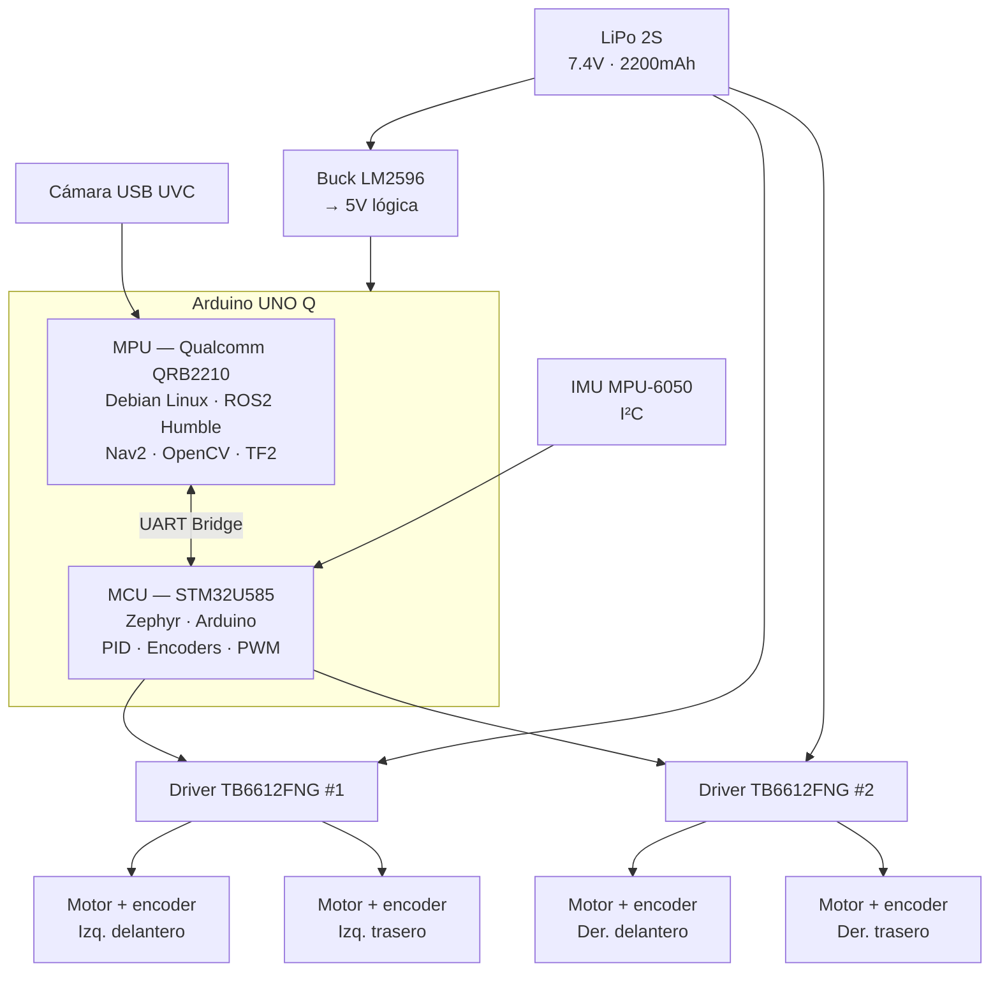

# Arquitectura del sistema

## Visión general

minibot-ros2 es un robot autónomo de 4 ruedas con arquitectura de dos capas de cómputo.

## Hardware principal

| Capa | Componente | Rol |
|------|-----------|-----|
| Cómputo alto nivel | Arduino UNO Q — MPU Qualcomm QRB2210 | ROS2, navegación, percepción |
| Cómputo tiempo real | Arduino UNO Q — MCU STM32U585 | PWM motores, lectura encoders, PID |
| Percepción | Cámara USB UVC + IMU MPU-6050 | Visión, orientación |
| Actuación | 4× TT Motor + encoder · 2× TB6612FNG | Tracción diferencial |
| Alimentación | LiPo 2S 2200mAh · Buck LM2596 | Potencia motores y lógica |

## Diagrama de capas

## Stack de software

- **OS:** Debian Linux (MPU) · Zephyr RTOS (MCU)
- **Framework:** ROS2 Humble
- **Navegación:** Nav2
- **Visión:** OpenCV
- **Control:** PID implementado en STM32
- **Comunicación MPU↔MCU:** UART bridge (Arduino RouterBridge)
